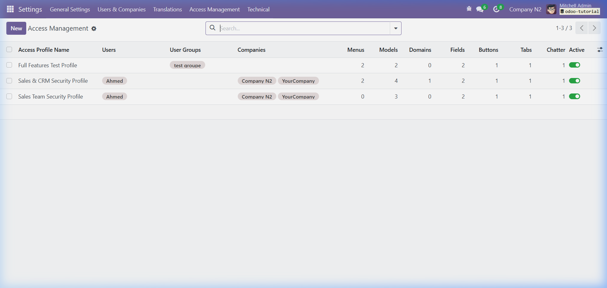
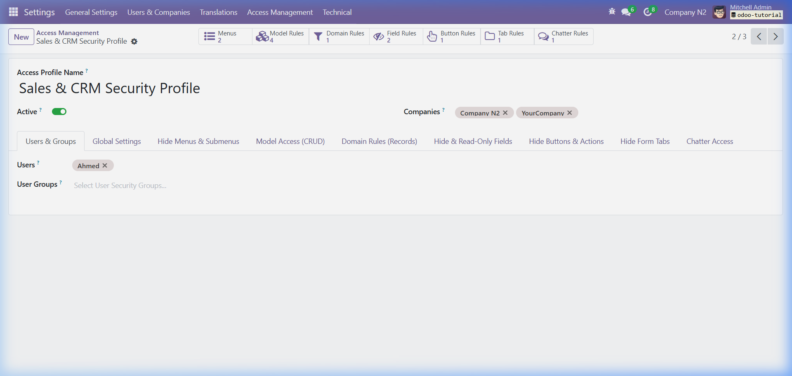
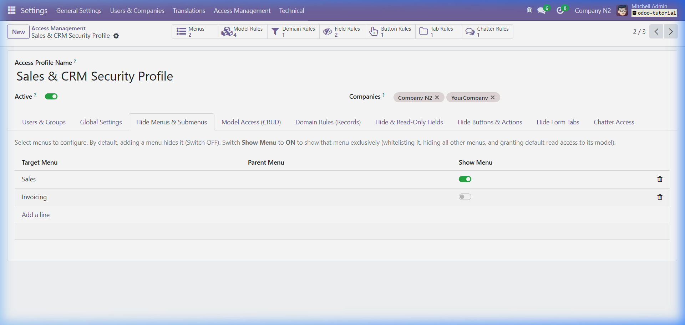
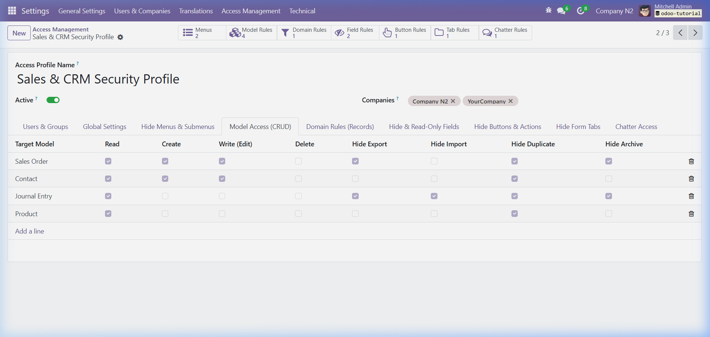
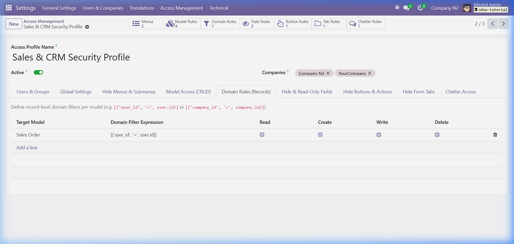
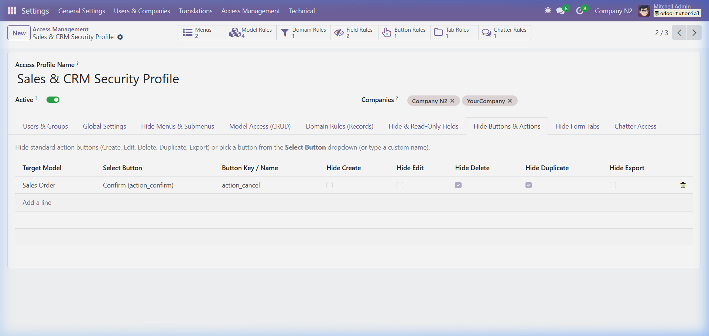

# 🛡️ Access Management for Odoo 17

[](https://www.odoo.com/)
[](https://www.gnu.org/licenses/lgpl-3.0.html)
[](https://www.odoo.com/apps)
[](https://www.odoo.com/)

**Access Management** is a centralized security control panel for Odoo 17. It empowers administrators to manage user-wise, group-wise, and multi-company permissions, menus, models, fields, buttons, notebook tabs, chatter, and global system policies from a single interactive dashboard—**without writing XML, managing complex group hierarchies, or touching standard Odoo user settings**.

---

## 📸 Visual Tour & Real System Screenshots

### 1. Centralized Access Profile Dashboard
Manage all security rules, general policies, and multi-company bindings with live smart stat counters.



---

### 2. Main Profile Form & Global Policies
Configure user and group assignments, system-wide Read-Only mode, Debug mode blocking, and global export/import/chatter toggles.



---

### 3. Menu Access Control & Auto Read Elevation (`Hide Menus & Submenus`)
Add menus to user navigation bars with **Show Menu (`is_show = True`)** to grant access on top of existing menus and automatically grant default Read access to underlying models. Leave toggle **OFF (`is_show = False`)** to hide specific menus.



---

### 4. Model CRUD Access Matrix & Action Restrictions (`Model Access (CRUD)`)
Check or uncheck **Read**, **Create**, **Write (Edit)**, and **Delete (Unlink)** permissions, and hide **Export**, **Import**, **Duplicate**, and **Archive** actions per model.



---

### 5. Record-Level Domain Filters & Field Security Rules (`Domain Rules`)
Apply dynamic Python/Odoo domain expressions (`[('user_id', '=', user.id)]`) per operation (Read, Create, Write, Delete).



---

### 6. Dynamic Button & Form Tab Discovery Dropdowns (`Hide Buttons & Form Tabs`)
Select any model to automatically discover and select buttons (e.g. `Confirm (action_confirm)`, `Cancel (action_cancel)`) and form tabs (e.g. `Order Lines (order_lines)`, `Other Info (other_information)`) directly from searchable dropdowns.



---

## ✨ Key Features & Capabilities

### 1. 📂 Additive & Subtractive Menu Visibility (`access.management.menu`)
* **Add Menus (`Show Menu = ON`)**: Adds the chosen menu (and its submenus) **on top of** what the user already has access to from standard groups.
* **Auto Read Access Elevation**: Automatically grants default **Read** permissions to underlying models (e.g., `sale.order`) and bypasses group record rules so records can be opened and viewed seamlessly.
* **Hide Menus (`Show Menu = OFF`)**: Subtracts/hides specific menus and submenus.
* **Empty Folder Pruning**: Automatically hides parent folders that have no visible children left.

---

### 2. 🔘 Dynamic Button & Tab Discovery Dropdowns
* Dynamic XML arch parser inspects views and provides searchable dropdowns (`button_item_id` / `tab_item_id`).
* Hide standard action buttons (Create, Edit, Delete, Duplicate, Export) or specific workflow buttons with one click.
* Hide notebook tabs (e.g., *Customer Signature*, *Other Information*, *Internal Notes*).

---

### 3. 🎛️ Model-Level CRUD Access Matrix (`access.management.model`)
* **Permission Elevation & Restriction**: Directly grant or revoke permissions (`perm_read`, `perm_create`, `perm_write`, `perm_unlink`) per model.
* **Child Model Auto-Resolution**: Line items (e.g. `sale.order.line`, `account.move.line`) automatically inherit access from their parent model.
* **Hide Export**: Hides the export button and Action menu Export option; blocks backend `export_data()`.
* **Hide Import**: Hides the Import action from the Cog Menu and list view; blocks backend `load()`.
* **Hide Duplicate**: Disables Duplicate from the Actions menu; blocks backend `copy()`.
* **Hide Archive**: Removes Archive / Unarchive from the Actions dropdown; blocks backend `action_archive()` and `action_unarchive()`.

---

### 4. 🎯 Domain / Record-Level Security Rules (`access.management.domain`)
* Define dynamic record filters using standard Odoo domain syntax:
  ```python
  [('user_id', '=', user.id)]
  [('company_id', '=', company.id)]
  [('state', 'in', ['draft', 'sent'])]
  ```
* Apply domains **specifically** per operation:
  * ✅ **Read / Search**: Filters search results and record listings.
  * ✅ **Create**: Validates record values upon creation.
  * ✅ **Write / Edit**: Restricts modifying records outside the permitted domain.
  * ✅ **Delete**: Prevents deleting records that fall outside the permitted domain.

---

### 5. 🔒 Field-Level Access Control (`access.management.field`)
* **Hide Field (`is_invisible`)**: Hides the field completely from form, tree, and kanban views.
* **Read-Only (`is_readonly`)**: Locks the field on the UI and protects it against ORM `write()` modifications.
* **Required (`is_required`)**: Forces a field to be mandatory on form views before saving.
* **Remove External Link (`remove_external_link`)**: Adds `options="{'no_open': True, 'no_create': True}"` on Many2one fields so users cannot click to open the related record popup.

---

### 6. 💬 Chatter Access Control (`access.management.chatter`)
* **Hide Entire Chatter**: Completely removes the chatter pane from form views.
* **Hide Send Message**: Disables the message composer button.
* **Hide Log Note**: Disables the internal note button.
* **Hide Activities**: Hides the schedule activity button and activity timeline.

---

### 7. 🌐 Global Security Policies (`access.management`)
* **Read-Only Mode**: Instantly places the user/company in read-only mode across the entire system.
* **Disable Developer Mode**: Strips debug capabilities and disables developer tools for restricted users.
* **Global Export / Import Restrictions**: One-click toggle to disable export or import system-wide.
* **Global Chatter Hiding**: One-click toggle to hide chatter across all models.

---

### 8. 🏢 Multi-Company & URL/Action Protection
* Scope any access profile to specific companies (`company_ids`).
* **Direct Navigation Protection**: Automatically intercepts direct URL parameter manipulation and company switching to prevent bypassing menu and action restrictions.

---

### 9. 💾 Automated Backup Solution (`backups/take_backup.sh`)
* Easily create timestamped `.tar.gz` module code archives and full PostgreSQL database dumps:
  ```bash
  /home/hp/src/tutorials/access_management/backups/take_backup.sh
  ```

---

## 🚀 Quick Setup Guide

1. Navigate to **Settings ➔ Access Management ➔ Access Management Profiles**.
2. Click **New** to create a profile (e.g., *Sales & CRM Security Profile*).
3. Assign the target **Users**, **User Groups**, and allowed **Companies**.
4. Configure your desired rules across the notebook tabs.
5. Click **Save**. The rules apply immediately in real-time.

---

## 👥 Supported Editions & Requirements

* **Odoo Version**: Odoo 17.0 (Community & Enterprise)
* **Dependencies**: `base`, `web`, `mail`
* **License**: LGPL-3

---

## 📄 License & Credits

Developed as part of the Enterprise Access Management Suite.
Released under the **GNU Lesser General Public License v3.0 (LGPL-3)**.
